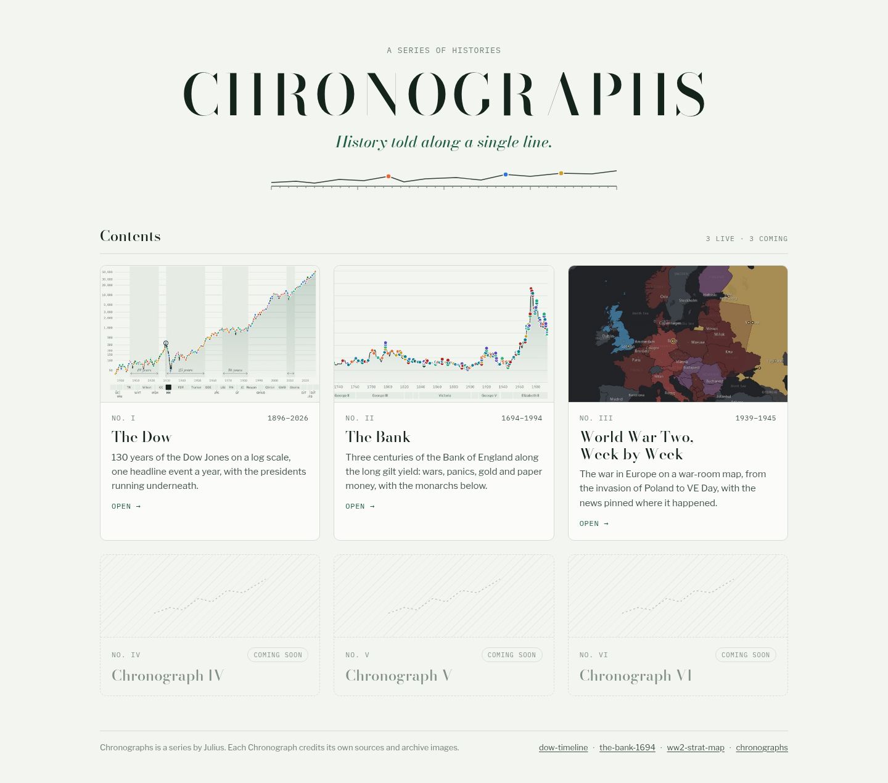

# Chronographs

The home page for **Chronographs**: a series of interactive histories, each told along a single line through time, with events that open onto archive sources.

**Live:** https://julianlee314-hue.github.io/chronographs/



## The Chronographs

| No. | Chronograph | Span | Site | Repo |
| --- | --- | --- | --- | --- |
| I | The Dow | 1896–2026 | [live](https://julianlee314-hue.github.io/dow-timeline/v0.2/) | [dow-timeline](https://github.com/julianlee314-hue/dow-timeline) |
| II | The Bank | 1694–1994 | [live](https://julianlee314-hue.github.io/the-bank-1694/) | [the-bank-1694](https://github.com/julianlee314-hue/the-bank-1694) |
| III | World War Two, Week by Week | 1939–1945 | [live](https://julianlee314-hue.github.io/ww2-strat-map/) | [ww2-strat-map](https://github.com/julianlee314-hue/ww2-strat-map) |
| IV–VI | Coming soon | | | |

## Adding or editing a Chronograph

Every card on the page comes from [`data/chronographs.json`](data/chronographs.json). Edit that file; no HTML changes are needed.

```json
{
  "title": "The Bank",
  "span": "1694–1994",
  "blurb": "One sentence on what the line and the events show.",
  "url": "https://julianlee314-hue.github.io/the-bank-1694/",
  "thumb": "img/bank.jpg",
  "repo": "https://github.com/julianlee314-hue/the-bank-1694",
  "status": "live"
}
```

| Field | Meaning |
| --- | --- |
| `title` | Card title. |
| `span` | Date range shown top-right of the card, e.g. `1896–2026`. Use an en dash. |
| `blurb` | One sentence. Optional on `soon` cards. |
| `url` | Link to the live site. Ignored for `soon` cards. |
| `thumb` | Path to a thumbnail under `img/`. 600×375 (16:10) JPEG works best; keep it 600px wide or less. |
| `repo` | *Optional.* GitHub repo URL; adds a link in the footer. |
| `status` | `live` (full card, clickable) or `soon` (dimmed placeholder card with a "Coming soon" badge). |

- **Order** in the file is the order on the page. The "No. I, II, III…" numerals are worked out from position, so they renumber themselves.
- **To launch a placeholder**, replace a `soon` entry with a real one: fill in the fields, add the thumbnail to `img/`, and set `"status": "live"`.
- **To add more placeholders**, copy a `soon` entry and change its title.

## Thumbnails

The three thumbnails in `img/` are headless-Chrome screenshots of each site's chart or map area, cropped to 600×375. The WW2 thumbnail shows the current map (late 1941) and should be re-shot once the war-room rebuild ships.

## Local preview

The page loads its JSON with `fetch`, so open it over http rather than `file://`:

```sh
python3 -m http.server 8000
# then visit http://localhost:8000/
```

## Design

Same paper-and-ink system as the Bank and Dow v0.2 Chronographs: Bodoni Moda for display type, Libre Franklin for body text, IBM Plex Mono for labels. Follows the system light/dark setting. No build step or dependencies; just `index.html`, `data/` and `img/`.
